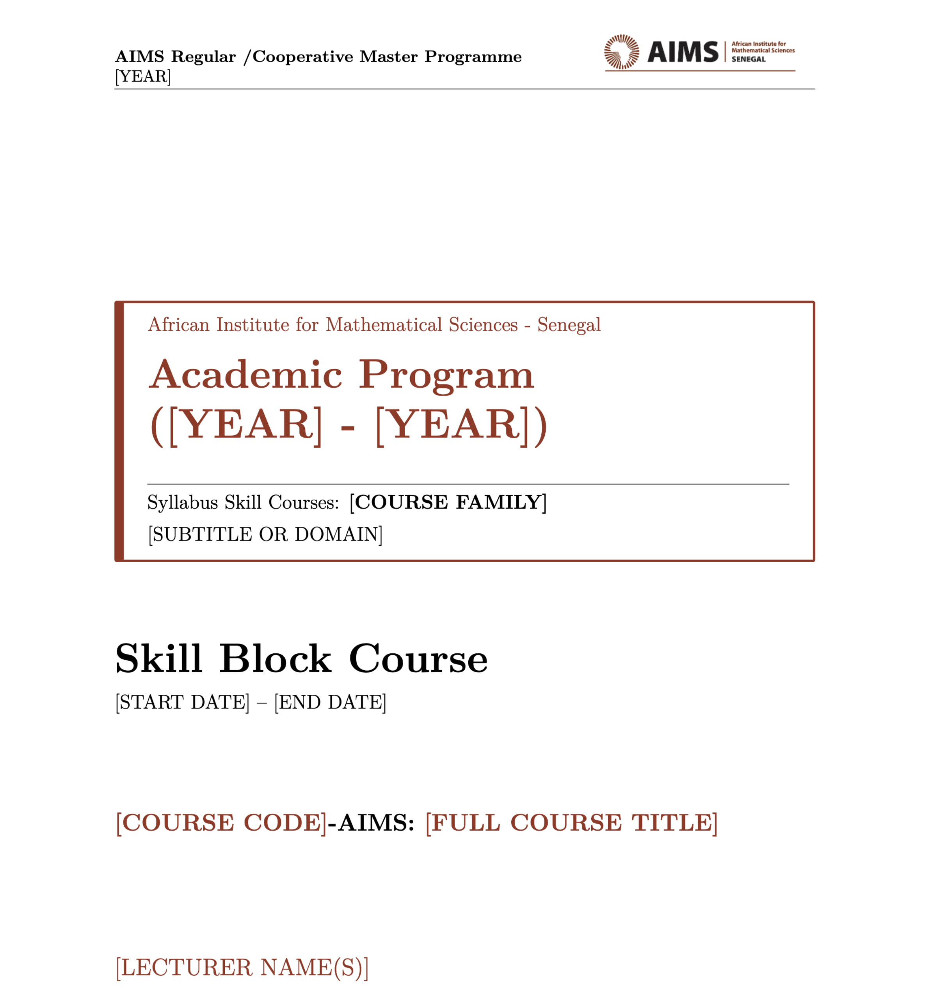

# AIMS Syllabus LaTeX Template



A professional LaTeX template built for the **African Institute for Mathematical Sciences (AIMS)** master's programs. 

This repository allows you to wrap standard Markdown-generated syllabus documents in a beautifully branded AIMS PDF format.

## Quickstart (Installation)

To get started with this template locally, you can clone the repository from GitHub:

```bash
# Clone the repository
git clone https://github.com/papasega/AIMS-Syllabus-Template.git

# Enter the directory
cd AIMS-Syllabus-Template

# Make the Unix compile script executable (Mac/Linux only)
chmod +x compile_unix.sh

# Compile the base template!
./compile_unix.sh
```
*(On Windows, you can simply run `compile_windows.bat`)*

## Structure

- `aims_syllabus.tex`: The overarching template containing the AIMS colors, the document structure, the dynamic cover page, and customized headers/footers.
- `aims_logo.png`: The institutional logo used in the header of every page.
- `course_body.tex`: This file contains the localized body of the syllabus. By default it is a dummy placeholder. 

## How to use

1. **Customize the Cover Page**: Open `aims_syllabus.tex` and replace the bracketed placeholders (`[YEAR]`, `[COURSE FAMILY]`, `[START DATE]`, `[LECTURER NAME]`) with your specific course information.

2. **Generate your course body**: 
   Instead of writing raw LaTeX, write your syllabus in a simple Markdown file (`my_course.md`). Then, convert it into LaTeX format using `pandoc`:
   ```bash
   pandoc my_course.md -t latex --top-level-division=section -o course_body.tex
   ```

3. **Compile your PDF**:
   We provide standalone scripts (`compile_unix.sh` and `compile_windows.bat`) that automatically download the lightweight *Tectonic* LaTeX compiler and build the PDF for you.

## Using with Overleaf

If you prefer a cloud-based editor without any local installation, this template works perfectly on **Overleaf**:

1. Log into your [Overleaf](https://www.overleaf.com/) account.
2. Click **New Project** > **Upload Project**.
3. Upload a `.zip` archive containing the cloned repository files (or manually create a new project and upload `aims_syllabus.tex`, `course_body.tex`, and `aims_logo.png`).
4. Set `aims_syllabus.tex` as the **Main Document** in the Overleaf *Menu* settings (top left corner) if it is not selected automatically.
5. In the compiler settings, make sure **XeLaTeX** is selected (this handles custom fonts and Unicode properly).
6. Click **Recompile** to generate and view your syllabus!

## Note on Tables from Markdown
Pandoc automatically widths columns relative to their length in Markdown. If a converted table columns are overlapping in the PDF compile, look inside `course_body.tex` for `\real{0.xx}` widths inside the `\begin{longtable}` sections, and manually adjust them so their sum across a single table equals roughly `1.0`.

## Author
**Papa Séga WADE**  
Website: [papasegawade.com](https://papasegawade.com)
